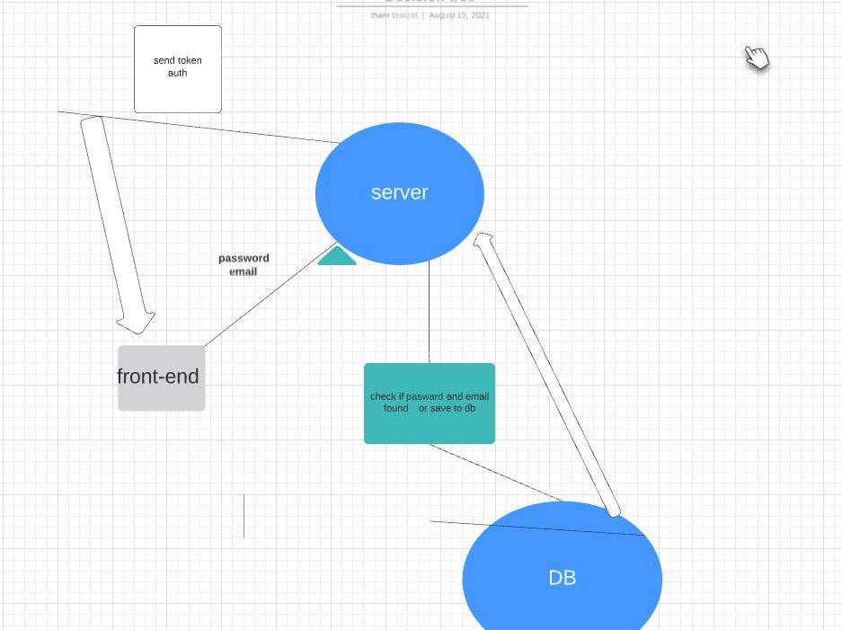

# basic-auth

## Deployment link
 [link](https://basic-express-s.herokuapp.com/)

## Author: Thaer Braizat

* [tests report](https://github.com/thaerbraizat/basic-express-server/actions)
* [front-end](https://basic-express-s.herokuapp.com/status)

### Setup
.env requirements
* PORT -3002
* NODE_ENV=test

### Running the app
* npm start

### Tests
Unit Tests: npm run test

### UML

